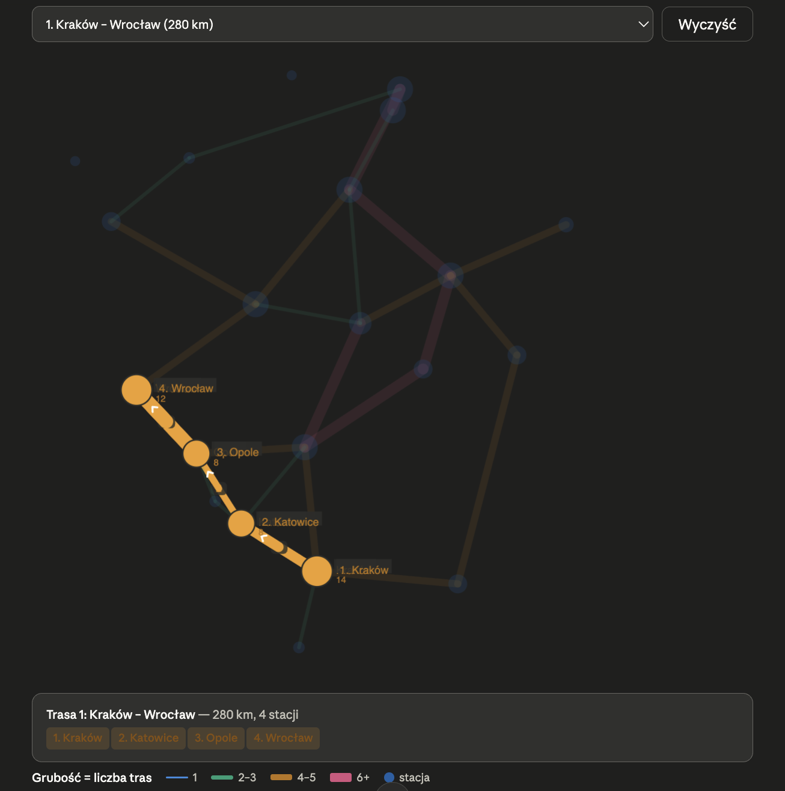

# Railway Reservation System

A C++/SQLite project focused on smart pointer usage, memory management, and clean object-oriented design.

---

## Overview

A CLI application for managing railway ticket reservations. The project models real-world relationships between domain objects, with deliberate and justified use of `unique_ptr`, `shared_ptr`, and `weak_ptr` throughout.

---

## Project Structure

```
Ticket_reservation_System/
├── build/
│   └── ..
├── src/
│   ├── main.cpp
│   ├── models/
│   │   ├── Station.hpp
│   │   ├── RouteStop.hpp
│   │   ├── Route.hpp
│   │   ├── Wagon.hpp
│   │   ├── Train.hpp
│   │   ├── Schedule.hpp
│   │   ├── Passenger.hpp
│   │   └── Reservation.hpp
│   ├── db/
│   │   ├── DBManager.hpp
│   │   └── DBManager.cpp
│   ├── logic/
│   │   ├── ReservationService.hpp
│   │   └── ReservationService.cpp
│   └── cli/
│       ├── CLI.hpp
│       └── CLI.cpp
├── db/
│   └── train.db
├── tests/
│   ├── ReservationTests.cpp
│   └── DBManagerTest.cpp
├── CMakeLists.txt
└── README.md

```

---

## Domain Model

### `Station`
A railway station.
```
id, name, city
shared across multiple routes via shared_ptr
```

### `RouteStop`
A single stop on a route — station + timing + order.
```
shared_ptr<Station> station
arrival_time, departure_time
stop_number
```
`RouteStop` is not a `Station` — it *has* a station (composition, not inheritance).

### `Route`
An ordered sequence of stops, e.g. Kraków → Katowice → Wrocław.
```
id, name, distance_km
vector<unique_ptr<RouteStop>> stops
```
`Route` owns its stops exclusively — `unique_ptr`.

### `Train`
A physical train consist (the actual coaches). Assigned to routes via `Schedule`.
```
id, name, type (IC / TLK / EIP)
vector<unique_ptr<Wagon>> wagons
```
`Train` owns its wagons exclusively — `unique_ptr`.

### `Wagon`
A single coach belonging to one `Train`.
```
id, wagon_number, class (1/2), seat_count
```

### `Schedule`
A concrete departure: which `Train` runs which `Route` on which date.
```
id, departure_date, departure_time
shared_ptr<Route> route
shared_ptr<Train> train
```
One train can be assigned to different routes on different days.

### `Passenger`
A person buying a ticket.
```
id, name, surname, email, phone_number
```

### `Reservation`
A single ticket reservation.
```
id, seat_number, wagon_number, status
weak_ptr<Schedule> schedule
weak_ptr<Passenger> passenger
```
Uses `weak_ptr` to observe `Schedule` and `Passenger` without taking ownership, avoiding reference cycles.

---

## Smart Pointer Usage

| Pointer | Where | Why |
|---|---|---|
| `unique_ptr<Wagon>` | `Train` owns wagons | Single owner, no sharing needed |
| `unique_ptr<RouteStop>` | `Route` owns stops | Single owner, stop has no meaning outside its route |
| `shared_ptr<Station>` | `RouteStop` references a station | Same station appears on multiple routes |
| `shared_ptr<Route>` | `Schedule` references a route | Route can be reused across schedules |
| `shared_ptr<Train>` | `Schedule` references a train | Train can be reused across schedules |
| `weak_ptr<Schedule>` | `Reservation` observes schedule | No ownership — schedule lives independently |
| `weak_ptr<Passenger>` | `Reservation` observes passenger | Breaks potential reference cycle |

---

## Object Relationships

```
Station ←── shared_ptr ───── RouteStop ───── unique_ptr ──→ Route
                                                                │
                                                          shared_ptr
                                                                │
Train ──── unique_ptr ──→ Wagon                           Schedule
  ↑                                                             │
  └──────────── shared_ptr ───────────────────────────────────┘
                                                                │
                                                          weak_ptr
                                                                │
Passenger ←── weak_ptr ──────────────────────────────── Reservation
```

---

## Database Schema

```sql
CREATE TABLE stations (
    id      INTEGER PRIMARY KEY,
    name    TEXT NOT NULL,
    city    TEXT NOT NULL
);

CREATE TABLE routes (
    id           INTEGER PRIMARY KEY,
    name         TEXT NOT NULL,
    distance_km  INTEGER
);

CREATE TABLE route_stops (
    id               INTEGER PRIMARY KEY,
    route_id         INTEGER REFERENCES routes(id),
    station_id       INTEGER REFERENCES stations(id),
    stop_number      INTEGER NOT NULL,
    arrival_time     TEXT,
    departure_time   TEXT
);

CREATE TABLE trains (
    id    INTEGER PRIMARY KEY,
    name  TEXT NOT NULL,
    type  TEXT NOT NULL
);

CREATE TABLE wagons (
    id           INTEGER PRIMARY KEY,
    train_id     INTEGER REFERENCES trains(id),
    wagon_number INTEGER NOT NULL,
    class        INTEGER NOT NULL,
    seat_count   INTEGER NOT NULL
);

CREATE TABLE passengers (
    id           INTEGER PRIMARY KEY,
    name         TEXT NOT NULL,
    surname      TEXT NOT NULL,
    email        TEXT UNIQUE NOT NULL,
    phone_number TEXT
);

CREATE TABLE schedules (
    id               INTEGER PRIMARY KEY,
    route_id         INTEGER REFERENCES routes(id),
    train_id         INTEGER REFERENCES trains(id),
    departure_date   TEXT NOT NULL,
    departure_time   TEXT NOT NULL
);

CREATE TABLE reservations (
    id           INTEGER PRIMARY KEY,
    schedule_id  INTEGER REFERENCES schedules(id),
    passenger_id INTEGER REFERENCES passengers(id),
    wagon_number INTEGER NOT NULL,
    seat_number  INTEGER NOT NULL,
    status       TEXT NOT NULL,
    price        DOUBLE
);
```

---

## Seeded Data

The database is pre-loaded with example data:

**Stations:** Kraków Główny, Katowice, Wrocław Główny, Warszawa Centralna, Gdańsk Główny etc.



**Routes:**
- Kraków → Katowice → Wrocław (280 km)
- Wrocław → Katowice → Kraków (280 km)
- Warszawa → Gdańsk (340 km)
- etc. 

**Trains:** IC 1234, IC 5678, EIP 101, etc. (each with wagons)

**Schedules:** 50 departures across 2025-08-01 and 2025-08-04

---

## DBManager

Handles all SQLite communication. Uses RAII — the connection opens in the constructor and closes automatically in the destructor.

```cpp
DBManager db("db/train.db");
db.initSchema();   // creates tables if they don't exist
db.seedData();     // inserts base data (INSERT OR IGNORE)

auto stations = db.getAllStations();  // returns vector<shared_ptr<Station>>
auto trains   = db.getAllTrains();    // returns vector<shared_ptr<Train>>
```

---

## CLI

Interactive terminal menu:

```
=== Railway Reservation System ===
1. List schedules
2. Make a reservation
3. My reservations
0. Exit
```

**List schedules** — shows all available departures with route and train info.

**Make a reservation** — user picks a schedule, provides passenger ID, wagon and seat number. System checks availability before booking.

**My reservations** — shows all active reservations for a given passenger ID.

---

## Build
Standard build without CMake and tests:

```bash
g++ -std=c++17 src/main.cpp src/db/DBManager.cpp src/logic/ReservationService.cpp src/cli/CLI.cpp -I src -lsqlite3 -o railway && ./railway
```

CMake build (checkout `CmakeLists.txt`):
```bash
cmake --build build
./build/railway #project build
./build/run_tests #tests build
```

---

## Implementation Progress

- [x] Domain models with smart pointers
- [x] DBManager — connection, schema, seed data
- [x] Read methods: `getAllStations()`, `getAllTrains()`, `getAllSchedules()`, `getWagonsForTrain()`
- [x] `getReservationsForPassenger()`
- [x] `ReservationService` — seat availability check + booking logic
- [x] `saveReservation()`
- [x] CLI — main loop, list schedules, make reservation, view reservations
- [ ] `cancelReservation()`
- [ ] Passenger registration via CLI
- [ ] Input validation
- [x] Unit tests with Google Test (some have been done)

---
